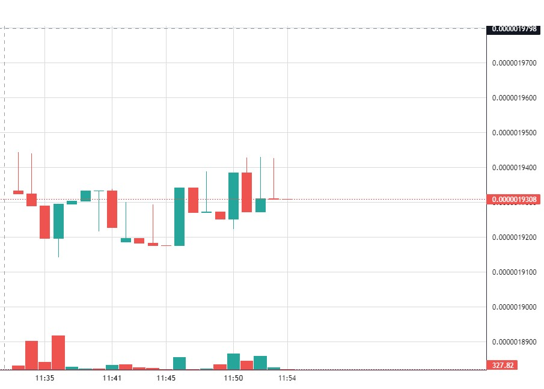

# realtime-on-chain-token-price-chart

this project is a demo of how to use tradingview lib to draw a realtime on-chain token price chart.

upon your rpc server, it can be faster than dexscreener.com, and you can customize the chart as you want.

## how to use

install the dependencies and run the server

    node price_provider.js

open the index.html in browser

this project is powered by tradinview lib, and rewrote from https://github.com/karthik947/TVChartsOwnData